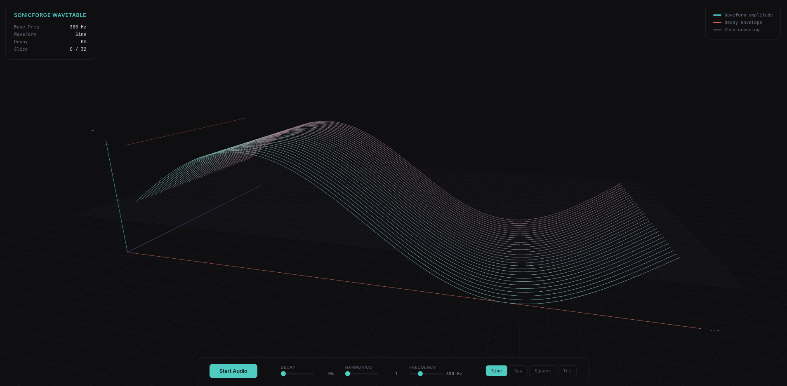

```
  ███████╗ ██████╗ ███╗   ██╗██╗ ██████╗███████╗ ██████╗ ██████╗  ██████╗ ███████╗
  ██╔════╝██╔═══██╗████╗  ██║██║██╔════╝██╔════╝██╔═══██╗██╔══██╗██╔════╝ ██╔════╝
  ███████╗██║   ██║██╔██╗ ██║██║██║     █████╗  ██║   ██║██████╔╝██║  ███╗█████╗
  ╚════██║██║   ██║██║╚██╗██║██║██║     ██╔══╝  ██║   ██║██╔══██╗██║   ██║██╔══╝
  ███████║╚██████╔╝██║ ╚████║██║╚██████╗██║     ╚██████╔╝██║  ██║╚██████╔╝███████╗
  ╚══════╝ ╚═════╝ ╚═╝  ╚═══╝╚═╝ ╚═════╝╚═╝      ╚═════╝ ╚═╝  ╚═╝ ╚═════╝ ╚══════╝
                              ╔═══════════════════╗
                              ║   D  S  P  ♪ ♫   ║
                              ╚═══════════════════╝
```

# SonicForge DSP

A high-performance C++ DSP library that compiles natively **and** to WebAssembly for browser-based 3D audio visualization.

[](https://opensource.org/licenses/MIT)

## ✨ Features

- **Waveform Generation**: Sine, Saw, Square, Triangle oscillators
- **Real-time Processing**: Sub-sample parameter modulation
- **Modular Architecture**: Chain oscillators, filters, envelopes
- **Zero-Copy Design**: Efficient buffer processing
- **Thread-Safe API**: Safe parameter changes from any thread
- **WebAssembly AudioWorklet Integration**: Run DSP chains directly in the browser
- **Real-time 3D Wavetable Visualization (Three.js)**: Interactive browser-based audio rendering

## 📁 Directory Structure

```
sonic-forge-dsp/
│
├── 🎛️  CMakeLists.txt          # Native build configuration
├── 📄  LICENSE                  # MIT License
├── 📖  README.md                # You are here!
├── 🔧  Doxyfile                 # Documentation generator config
│
├── include/sonicforge/         # ┌─────────────────────────────┐
│   └── oscillator.hpp          # │  PUBLIC API HEADERS         │
│                               # │  Include these in your code │
│                               # └─────────────────────────────┘
├── src/                        # ┌─────────────────────────────┐
│   └── oscillator.cpp          # │  IMPLEMENTATION             │
│                               # │  DSP algorithms live here   │
│                               # └─────────────────────────────┘
├── tests/                      # ┌─────────────────────────────┐
│   └── oscillator_test.cpp     # │  UNIT TESTS                 │
│                               # │  Mathematical verification  │
│                               # └─────────────────────────────┘
├── examples/                   # ┌─────────────────────────────┐
│   ├── sine_example.cpp        # │  EXAMPLES                   │
│   └── wav_writer_example.cpp  # │  Learn by running these!    │
│                               # └─────────────────────────────┘
├── cmake/                      # CMake helpers & pkg-config
│   └── sonicforge.pc.in        #
│
├── web/                        # ┌─────────────────────────────┐
│   ├── CMakeLists.txt          # │  WebAssembly build config   │
│   ├── src/                    # │                             │
│   │   └── sonicforge_worklet.cpp # AudioWorklet processor     │
│   └── public/                 # │  Three.js 3D visualization  │
│                               # └─────────────────────────────┘
│
├── .clang-format               # Code style configuration
├── .clang-tidy                 # Static analysis rules
└── .gitignore                  # Git ignore patterns
```

## 🚀 Overview

**SonicForge DSP** is a lightweight C++ framework focused on low-latency signal generation and processing. This project serves as a showcase of modern systems programming practices, specifically addressing the unique constraints of real-time audio—where heap allocation and thread-blocking are strictly avoided to ensure signal stability.

The library now extends beyond native audio pipelines with full WebAssembly support, enabling real-time DSP chains to run inside browser AudioWorklet contexts paired with Three.js-powered 3D wavetable visualization.

## 🛠️ Technical Highlights

* **Real-time Safe Architecture:** Implementation follows "lock-free" and "allocation-avoidant" patterns in the audio callback to prevent priority inversion and audio glitches.
* **Modern C++ Standard:** Leverages C++17/20 features including smart pointers for memory management, `std::atomic` for thread-safe parameter modulation, and templates for efficient buffer processing.
* **Cross-Platform Compilation:** Builds natively on Linux and compiles to WebAssembly via Emscripten for in-browser execution.
* **Browser-Native Audio:** AudioWorklet integration for sample-accurate processing in modern browsers without main-thread interference.

## 📑 Prerequisites

### Native Build

* C++17/20 compatible compiler (GCC 9+ or Clang 10+)
* CMake 3.15+
* Make or Ninja build system

### WebAssembly Build

* Emscripten SDK (emsdk 3.1.0+)
* CMake 3.15+
* A modern browser with WebAssembly and AudioWorklet support

## 🔨 Building

### Native Build

```bash
# Clone the repository
git clone https://codeberg.org/Nanometer7008/sonic-forge-dsp.git
cd sonic-forge-dsp

# Configure and Build
mkdir build && cd build
cmake ..
make -j$(nproc)

# Run Tests
ctest --output-on-failure
```

#### Build with Ninja (Recommended)

```bash
mkdir build && cd build
cmake -G Ninja ..
ninja
```

#### Build Types

```bash
# Release build (optimized, -O3 -march=native)
cmake -DCMAKE_BUILD_TYPE=Release ..

# Debug build (with AddressSanitizer and UndefinedBehaviorSanitizer)
cmake -DCMAKE_BUILD_TYPE=Debug ..
```

#### CMake Build Options

| Option | Default | Description |
|--------|---------|-------------|
| `SONICFORGE_BUILD_EXAMPLES` | `ON` | Build example programs |
| `SONICFORGE_BUILD_TESTS` | `ON` | Build unit tests |
| `SONICFORGE_BUILD_WEB` | `OFF` | Build WebAssembly AudioWorklet module |

### WebAssembly Build

#### Option 1: Via root CMake (recommended)

```bash
mkdir build && cd build
cmake .. -DSONICFORGE_BUILD_WEB=ON -DCMAKE_BUILD_TYPE=Release
make -j$(nproc)
```

#### Option 2: Standalone Emscripten build

```bash
cd web
emcmake cmake -B build-web -DCMAKE_BUILD_TYPE=Release
cmake --build build-web
```

Both produce a `.wasm` binary output to `web/public/`. Serve that directory with any static file server to run the 3D visualization in your browser.

## 🎵 Usage

### Basic Example

```cpp
#include <sonicforge/oscillator.hpp>

int main() {
    // Create a sine wave oscillator at A4 (440 Hz)
    sonicforge::Oscillator osc(sonicforge::Waveform::SINE, 440.0f);
    osc.set_sample_rate(48000.0f);

    constexpr size_t BUFFER_SIZE = 256;
    float buffer[BUFFER_SIZE];

    osc.process_block(buffer, BUFFER_SIZE);

    osc.set_frequency(880.0f);
    osc.set_waveform(sonicforge::Waveform::SAW);

    return 0;
}
```

### Linking to Your Project

Using CMake:

```cmake
find_package(PkgConfig REQUIRED)
pkg_check_modules(SONICFORGE REQUIRED IMPORTED_TARGET sonicforge)

target_link_libraries(your_target PRIVATE PkgConfig::SONICFORGE)
```

Or manually:

```bash
g++ -std=c++17 your_code.cpp -lsonicforge -o your_app
```

## 📊 Performance Benchmarks

All benchmarks run on **AMD Ryzen 7 5800X**, Fedora 40, 48kHz sample rate:

| Metric | Value | Notes |
|--------|-------|-------|
| **Latency** | < 1.5ms | 64-sample buffer |
| **Oscillator CPU** | ~0.02% | Per-voice sine wave |
| **Polyphony** | 64+ voices | < 3% CPU total |
| **Parameter Modulation** | Sub-sample | Lock-free atomic updates |
| **Wasm Overhead** | < 5% | vs. native, AudioWorklet |

## 🎯 What You Can Build

- **Modular Synthesizers**: Chain oscillators, filters, and envelopes for complex sound design
- **Audio Effects**: Process live input with custom DSP chains
- **Real-time Generators**: Create procedural audio for games and interactive media
- **Audio Plugins**: Build VST/LV2 plugins (with additional wrapper code)
- **Browser-Based Audio Tools**: Deploy DSP chains to the web with AudioWorklet
- **3D Audio Visualizations**: Render wavetables and spectrograms with Three.js

## 📚 Documentation

API documentation is generated using Doxygen:

```bash
cd docs && doxygen ../Doxyfile
```

Documentation will be available in the `docs/html/` directory.

## 📝 What's New

### Recent Changes

- **WebAssembly DSP Bridge**: Full Emscripten build pipeline enabling the core DSP library to run in browser environments
- **AudioWorklet Processor**: `sonicforge_worklet.cpp` provides a sample-accurate audio processing node for the Web Audio API
- **3D Wavetable Visualization**: Three.js-powered real-time renderer in `web/public/` for interactive audio visualization
- **Web CMake Toolchain**: Dedicated `web/CMakeLists.txt` for streamlined Wasm builds with proper export configuration

## 👥 Contributing

Contributions are welcome! Please follow these steps:

1. Fork the repository
2. Create a feature branch (`git checkout -b feature/AmazingFeature`)
3. Commit your changes (`git commit -m 'Add some AmazingFeature'`)
4. Push to the branch (`git push origin feature/AmazingFeature`)
5. Open a pull request

### Coding Standards

* Follow modern C++ best practices
* Use clang-format with the provided configuration
* Write unit tests for new functionality
* Document public APIs with Doxygen comments

## ⚖️ License

This project is licensed under the MIT License - see the [LICENSE](LICENSE) file for details.

## ❤️ Acknowledgments

* Inspired by the modular synthesis community
* Built with insights from the Linux audio development ecosystem
* Thanks to all contributors and testers
