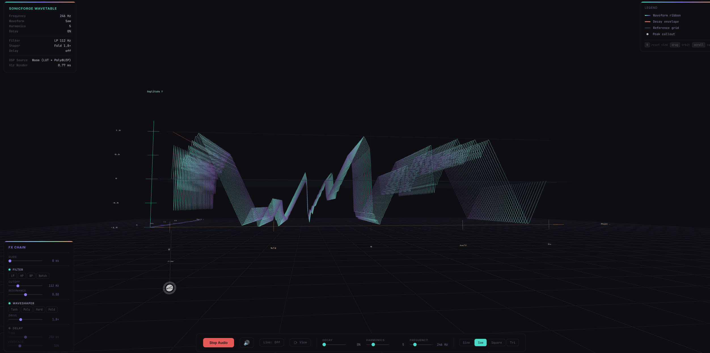

<p align="center">
  
  <br>
  
</p>

# SonicForge DSP

A lightweight C++ oscillator and effects library for real-time audio synthesis, with WebAssembly support for browser-based DSP.

[](https://opensource.org/licenses/MIT)
[](https://github.com/khenderson20/sonic-forge-dsp/actions/workflows/ci.yml)
[](https://khenderson20.github.io/sonic-forge-dsp/)

---

## Quick Start

```bash
git clone https://github.com/khenderson20/sonic-forge-dsp.git
cd sonic-forge-dsp
cmake -B build -DSONICFORGE_BUILD_TESTS=ON
cmake --build build --parallel
ctest --test-dir build          # 61 tests, all should pass
```

---

## Overview

SonicForge DSP provides a collection of zero-allocation, thread-safe audio processing modules suitable for synthesizers, effects plugins, and modular audio systems:

| Module | Purpose |
|--------|---------|
| `Oscillator` | Band-limited sine (4096-entry LUT), saw/square (PolyBLEP anti-aliased), triangle |
| `StateVariableFilter` | Resonant lowpass/highpass/bandpass/notch (Cytomic/Zavalishin ZDF topology) |
| `DelayLine` | Fractional-sample delay with none, linear, and 3rd-order Lagrange interpolation |
| `Waveshaper` | tanh, polynomial soft clip, hard clip, Buchla-style wavefolder |
| `SmoothedValue` | Linear and multiplicative (exponential) sub-sample parameter ramping |

### Key Design Decisions

- **No heap allocation in the audio path** — `process()` and `process_block()` perform zero dynamic memory allocation
- **Lock-free parameter access** — Oscillator and SVF use `std::atomic` with `memory_order_relaxed` for thread-safe modulation
- **C++17, zero runtime dependencies** — GoogleTest is only used for tests (fetched via CPM.cmake)
- **WebAssembly ready** — compiles to a standalone `.wasm` binary via Emscripten for AudioWorklet use

### What This Library Does Not Provide

- **No envelopes** — no ADSR or envelope generator
- **No DSP chaining** — no `connect()` or node graph; each module is standalone
- **No polyphony management** — no voice pool or voice stealing
- **No wavetable oscillator** — waveforms are generated algorithmically; no wavetable loading

---

## Installation

### Prerequisites

| Requirement | Version |
|-------------|---------|
| Compiler | GCC 9+ or Clang 10+ |
| CMake | 3.15+ |
| Emscripten (optional) | 3.1.0+ — only needed for Wasm builds |

### Build Options

| Option | Default | Description |
|--------|---------|-------------|
| `SONICFORGE_BUILD_TESTS` | `ON` | Build unit tests (fetches GoogleTest automatically) |
| `SONICFORGE_BUILD_EXAMPLES` | `ON` | Build example programs |
| `SONICFORGE_BUILD_WEB` | `OFF` | Build WebAssembly AudioWorklet module (requires `emcmake cmake`) |
| `SONICFORGE_OPTIMIZE_FOR_HOST` | `OFF` | Add `-march=native` to Release builds |
| `SONICFORGE_ENABLE_LTO` | `ON` | Enable link-time optimisation for Release builds |

### Build Types

```bash
# Debug (default)
cmake -B build -DSONICFORGE_BUILD_TESTS=ON

# Release (optimized)
cmake -B build -DCMAKE_BUILD_TYPE=Release -DSONICFORGE_BUILD_TESTS=ON

# Ninja (for incremental builds)
cmake -B build -G Ninja -DSONICFORGE_BUILD_TESTS=ON
```

### CPM Caching

Avoid re-downloading GoogleTest on clean builds:

```bash
export CPM_SOURCE_CACHE=~/.cache/CPM
```

### WebAssembly Build

Requires the Emscripten SDK:

```bash
cd web
emcmake cmake -B build-web -DCMAKE_BUILD_TYPE=Release
cmake --build build-web
```

The output `sonicforge.wasm` is placed in `web/public/`. Serve that directory with a static file server to run the 3D visualization demo.

---

## Usage

### Basic Example

```cpp
#include <sonicforge/oscillator.hpp>

int main() {
    sonicforge::Oscillator osc(sonicforge::Waveform::SINE, 440.0F);
    osc.set_sample_rate(48000.0F);

    float buffer[256];
    osc.process_block(buffer, 256);

    // Thread-safe parameter changes (safe from any thread)
    osc.set_frequency(880.0F);
    osc.set_waveform(sonicforge::Waveform::SAW);
    return 0;
}
```

### Complete Synth Chain

```cpp
#include <sonicforge/oscillator.hpp>
#include <sonicforge/smoothed_value.hpp>
#include <sonicforge/state_variable_filter.hpp>
#include <sonicforge/waveshaper.hpp>
#include <sonicforge/delayline.hpp>

// Signal: saw → lowpass filter → tanh waveshaper → delay
sonicforge::Oscillator osc{sonicforge::Waveform::SAW, 440.0F, 48000.0F};

sonicforge::StateVariableFilter filter{
    sonicforge::FilterMode::Lowpass, 2000.0F, 0.3F, 48000.0F};

sonicforge::WaveshaperProcessor ws{sonicforge::WaveshaperShape::Tanh, 2.0F};

sonicforge::DelayLine<sonicforge::DelayInterpolation::Linear> delay{24000};
delay.set_delay(4800.0F);
delay.set_feedback(0.3F);

float buffer[256];
osc.process_block(buffer, 256);       // 1. Oscillator
filter.process_block(buffer, 256);    // 2. Filter
ws.process_block(buffer, 256);        // 3. Waveshaper
delay.process_block(buffer, 256);     // 4. Delay
```

### Module Examples

**SmoothedValue — click-free parameter ramps:**

```cpp
sonicforge::SmoothedValue<sonicforge::SmoothingMode::Multiplicative> freq;
freq.reset(440.0F, 48000.0F);
freq.set_ramp_duration(0.02F);       // 20 ms exponential ramp
freq.set_target(880.0F);             // begin ramping

for (int i = 0; i < 256; ++i) {
    float g = freq.process();        // one sample of the ramp
    buffer[i] *= g;
}
```

**Waveshaper — distortion and wavefolding:**

```cpp
float sample = sonicforge::soft_clip_tanh(input * drive);  // tanh saturation
sample = sonicforge::wavefold_buchla(input * drive);        // Buchla 259 fold
```

**DelayLine — fractional-sample delay:**

```cpp
sonicforge::DelayLine<sonicforge::DelayInterpolation::Lagrange3rd> dl{48000};
dl.set_delay(9600.0F);      // 200 ms at 48 kHz
float tap = dl.read(4800.5F);  // fractional read (no feedback)
```

### Linking to Your Project

**Via CMake FetchContent (recommended — no install step needed):**

```cmake
include(FetchContent)
FetchContent_Declare(
    sonicforge
    GIT_REPOSITORY https://github.com/khenderson20/sonic-forge-dsp.git
    GIT_TAG main
)
FetchContent_MakeAvailable(sonicforge)
target_link_libraries(your_target PRIVATE sonicforge)
```

**Via CMake subdirectory (vendored copy):**

```cmake
add_subdirectory(path/to/sonic-forge-dsp)
target_link_libraries(your_target PRIVATE sonicforge)
```

**Via pkg-config (requires `cmake --install` first):**

```bash
cmake --install build                          # installs to /usr/local by default
cmake --install build --prefix /your/prefix   # or a custom prefix
```

```cmake
find_package(PkgConfig REQUIRED)
pkg_check_modules(SONICFORGE REQUIRED IMPORTED_TARGET sonicforge)
target_link_libraries(your_target PRIVATE PkgConfig::SONICFORGE)
```

If installed to a non-default prefix, tell pkg-config where to look:

```bash
export PKG_CONFIG_PATH=/your/prefix/lib/pkgconfig:$PKG_CONFIG_PATH
```

**Manual compilation (requires `cmake --install` first):**

```bash
g++ -std=c++17 -I/usr/local/include your_code.cpp -L/usr/local/lib -lsonicforge -o your_app
```

Replace `/usr/local` with your install prefix if it differs.

---

## Testing

61 test cases across 11 suites cover all modules:

| Module | Cases | Coverage |
|--------|-------|----------|
| Oscillator | 22 | Construction, range, PolyBLEP, LUT accuracy, block/sample processing, sample_at static evaluation |
| SmoothedValue | 7 | Linear/multiplicative ramping, snap, process_block |
| StateVariableFilter | 10 | LP/HP attenuation, DC pass-through, clamping, reset |
| Waveshaper | 10 | Transfer function bounds (tanh, poly, hard clip, fold, rectify), processor, null safety |
| DelayLine | 11 | Integer/fractional delay, feedback, interpolation modes, reset |
| Integration | 1 | Full chain: oscillator → SVF → waveshaper → delay |

```bash
ctest --test-dir build --output-on-failure
```

---

## Code Quality

The project enforces formatting and static analysis via pre-commit hooks and CI:

| Tool | Purpose |
|------|---------|
| `clang-format-18` | Enforces consistent code style (ColumnLimit 120, 4-space indent) |
| `clang-tidy-18` | Static analysis with `--warnings-as-errors='*'` (bugprone, cppcoreguidelines, misc, modernize, performance, readability, clang-analyzer) |

**Generate compile_commands.json and run clang-tidy:**

```bash
cmake -B build -DCMAKE_EXPORT_COMPILE_COMMANDS=ON -DSONICFORGE_BUILD_TESTS=ON
clang-tidy --warnings-as-errors='*' -p build \
    src/oscillator.cpp src/state_variable_filter.cpp src/delayline.cpp \
    tests/oscillator_test.cpp tests/new_modules_test.cpp
```

---

## Project Structure

```
sonic-forge-dsp/
├── include/sonicforge/          # Public API headers (5 modules)
├── src/                         # Implementation files
├── tests/                       # GoogleTest unit tests (61 cases)
├── examples/                    # Example programs
│   ├── sine_example.cpp         # Pipeable raw float output
│   └── wav_writer_example.cpp   # WAV file generator
├── web/                         # WebAssembly build + Three.js demo
│   ├── src/sonicforge_worklet.cpp   # C bridge for AudioWorklet
│   └── public/                  # Three.js 3D visualization
├── .github/workflows/ci.yml     # GitHub Actions CI
├── CMakeLists.txt               # Root build configuration
└── Doxyfile                     # API documentation generator
```

---

## Contributing

1. Fork the repository and create a feature branch
2. Install pre-commit hooks: `bash scripts/install-hooks.sh`
3. Write code following modern C++17 practices, zero allocation in audio paths
4. Add unit tests for new functionality
5. Document public APIs with Doxygen comments (`@brief`, `@param`, `@return`)
6. Ensure clang-format, clang-tidy, and all tests pass before submitting a PR

---

## License

MIT License — see the [LICENSE](LICENSE) file for details.

GoogleTest is used solely for the test suite and is fetched automatically by CPM.cmake. It is not linked into the installed library and does not affect the licensing of `libsonicforge`.

---

## Documentation

The API reference is published automatically to GitHub Pages on every merge to `main`:

**https://khenderson20.github.io/sonic-forge-dsp/**

To build the docs locally:

```bash
doxygen Doxyfile
```

Output will be available at `docs/html/index.html`.

---

## Changelog and Roadmap

- [CHANGELOG.md](CHANGELOG.md) — per-version history of changes
- [ROADMAP.md](ROADMAP.md) — planned features and longer-term direction
